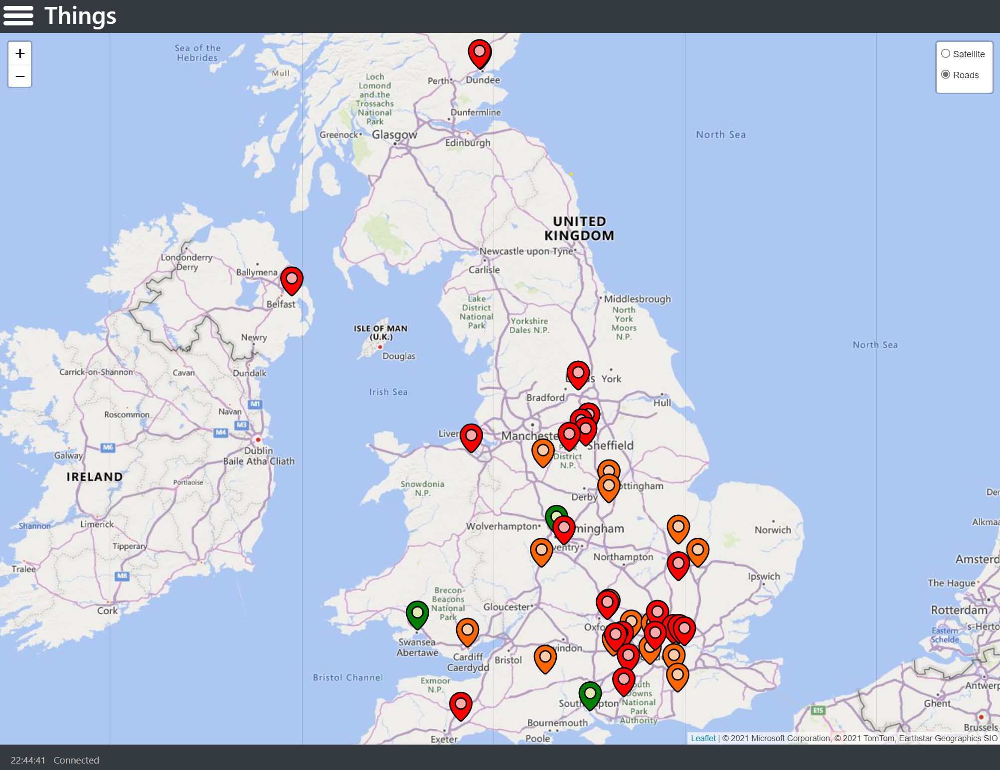
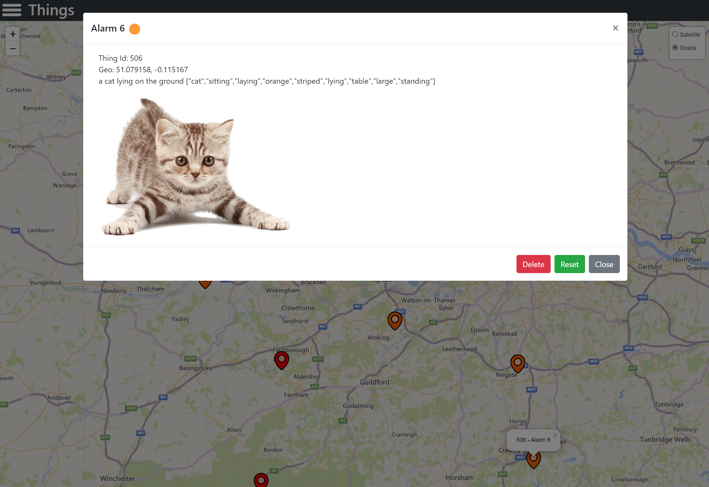

# ThingsWeb

Example response for AppDev Challenge <https://markharrison.io/appdev-challenge/>

Complete solution <https://markharrison.io/appdev-challenge/day2-complete>

## Configuration

Environment variables / configuration 

| Key          | Value     |  
|--------------|-----------| 
| ThingsAPIUrl | URL of API - see <https://github.com/markharrison/thingsapi>  |  
| MapSKey      | API Key for Maps Service   |   
| MapSource    | 'Azure' or 'Bing' - choice of mapping services  |  
| MapStartLong | Center of initial map displayed - longitude |  
| MapStartLat  | Center of initial map displayed - latitude  |  
| MapStartZoom | Zoom level of initial map displayed |  

## Infrastructure as Code

<https://github.com/markharrison/ThingsWeb/blob/main/infra/README.md>

## Package 

<https://github.com/markharrison/ThingsWeb/pkgs/container/thingsweb>
